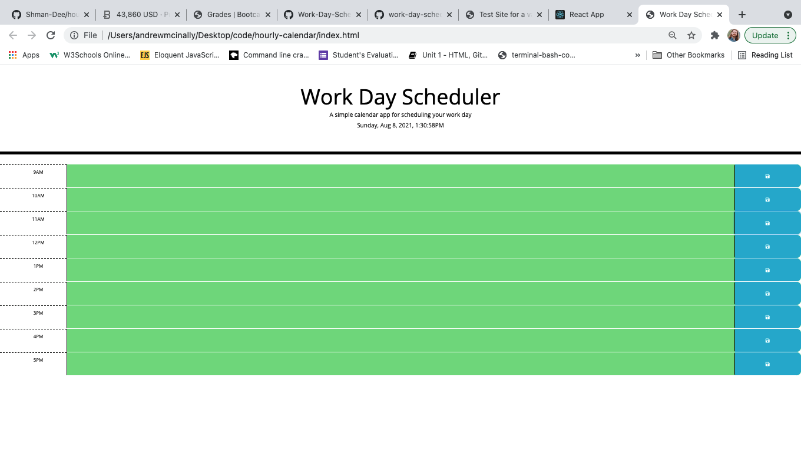

# hourly-calendar

I built an online work scheduler. The calendar shows the hours of 9am to 5pm. You can click on a block to add an event that is saved to local storage. The blocks recognize time and change color in accordance. I had help from YouTube videos, W3, and StackOverflow.

